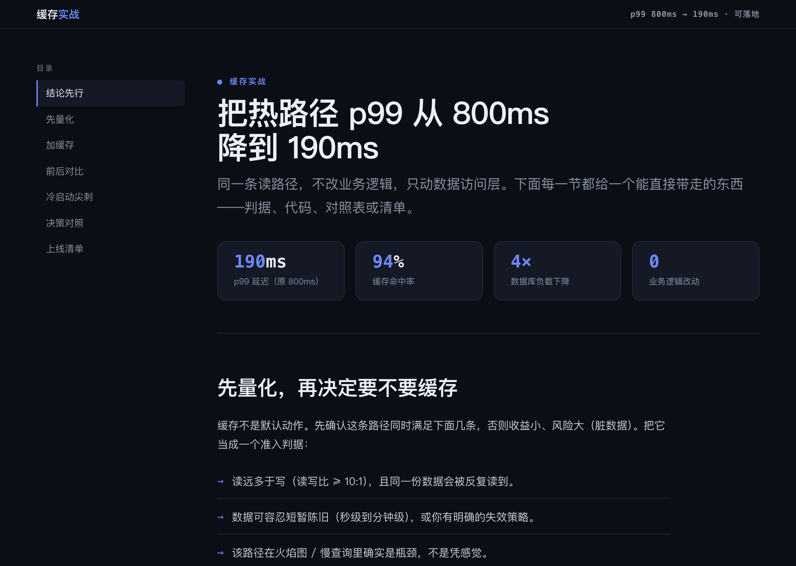

# Sharecraft

[简体中文](README.md) · **English**

> A Claude Code skill that makes share-worthy **slide decks, posters/cards/images, explainer videos, and interactive HTML** — by pairing best-in-class **local, zero-API** open-source tools with a real *"how to make a great share"* methodology.


Tools make output *fast*. They don't make it *good*. A pretty slide that buries its point, a card that's unreadable as a thumbnail, a 5-minute video that should've been 90 seconds — these all pass the "I used a nice tool" test and still fail the audience. **Sharecraft fixes the part the tools leave out**: it forces a short thinking pass (who's the audience, what's the one takeaway, where will this be consumed), then drives the right open-source tool to produce the artifact — and self-reviews it against the principles that make each medium land.

## What it does

When you ask Claude to make something shareable, Sharecraft kicks in and:

1. **Thinks first** — audience, the single takeaway, the action you want, the medium & platform (this decides aspect ratio and length more than anything), and the effort budget.
2. **Picks the medium and combines** — one content core → a deck *and* a launch card *and* a demo GIF, all visually consistent. Real leverage is in chaining tools, not using one.
3. **Learns from the best — the principle, not the look** — distills the underlying principles that 3Blue1Brown, Kurzgesagt, Fireship, TED, Tufte and others keep rediscovering, then invents an expression that fits *your* topic.
4. **Sets up the tool and builds** — one local, zero-pollution install (`./setup.sh`), the minimal authoring loop, and how to export.
5. **Self-reviews** against the medium's checklist *and* the shared design contract's anti-pattern pass before handing over.

## The shared design contract

Four media stay coherent only if they pull from one contract. [`references/design-system.md`](references/design-system.md) is that contract — design tokens (a copy-paste `:root`), one reading measure, code-block and flowchart/chart specs, the product-vs-brand registers, and an anti-pattern self-check. Its throughline, learned the hard way from real generated pages:

> **Take over the *look*, not the *engine*.** A tool's default is built for everyone, so it's invisible. Looking intentional means flipping *one* style switch — Mermaid `look:'handDrawn'`, a Chart.js theme override — and letting the tool keep doing the hard part (layout, axes, routing). Re-authoring the engine by hand is the trap: more work, more bugs, rarely better.

## Examples

Every artifact below was produced by the very tools Sharecraft drives — and shaped by the contract (one dark base, off-white text, clear hierarchy, thumbnail-readable). Each example deliberately uses a *different* accent (indigo, emerald, violet, amber, sky…) to show the range — within any single deliverable you'd hold to one. All source files live in [`examples/`](examples/).

**Slides** — a [Marp](https://marp.app/) deck ([`slides-deck.md`](examples/slides-deck.md)) exported to PNG. Title states the takeaway, one idea per slide, the last slide is the ask:

| | |
|:---:|:---:|
|  |  |
|  |  |

**Named layout recipes in action** — all ten `SL01–SL10` recipes from [`slides.md`](references/slides.md) made real in one deck ([`slide-recipes.md`](examples/slide-recipes.md)); each slide is tagged with the recipe it uses. A sample:

| SL04 · Data hero | SL05 · Two-column compare |
|:---:|:---:|
|  |  |
| **SL06 · Code spotlight** | **SL07 · Pull quote** |
|  |  |

**Terminal GIF** — recorded with [VHS](https://github.com/charmbracelet/vhs) from a reproducible script ([`terminal-demo.tape`](examples/terminal-demo.tape)). A clean, scripted flow under 15s — here, batch-rendering a whole carousel (`--ids`) in one browser session:


**Explainer animation** — the `VS02→VS03→VS04` shot recipes from [`video.md`](references/video.md) (concrete first → morph to the general form → spotlight the insight), built in [Manim](https://www.manim.community/) ([`vs-concrete-to-abstract.py`](examples/vs-concrete-to-abstract.py)):


**Interactive HTML** — three of the `IH01–IH08` recipes from [`interactive.md`](references/interactive.md), each a self-contained, zero-API single file that opens straight in a browser. They put principle ⑥ to work — *active beats passive*: you drive the artifact instead of watching it. Click a preview for the **live** version, or read the source:

| IH01 · Explorable | IH02 · Scrollytelling | IH03 · Interactive chart |
|:---:|:---:|:---:|
| [](https://raw.githack.com/ma-pony/sharecraft/main/examples/explorable-area.html) | [](https://raw.githack.com/ma-pony/sharecraft/main/examples/scrolly-latency.html) | [](https://raw.githack.com/ma-pony/sharecraft/main/examples/chart-latency.html) |
| *Drag the sliders, derive `Area = w × h` yourself.* [source](examples/explorable-area.html) | *Scroll; the pinned figure changes one thing per step (800ms → 190ms).* [source](examples/scrolly-latency.html) | *Hover for values, click the legend to toggle a series.* [source](examples/chart-latency.html) |

**Single-page site (IH09)** — a doc or guide built as a *real website*, not a blog column or a PPT-flip deck: a sidebar TOC with scroll-spy, distinct per-section layouts, native interactions (`<details>`, copy-to-clipboard), full interactive states, responsive — still one self-contained `.html` ([`interactive.md`](references/interactive.md) IH09):

[](https://raw.githack.com/ma-pony/sharecraft/main/examples/doc-site.html)

**Flowchart** — Mermaid in `look: 'handDrawn'`, themed to the tokens (the recipe in [`design-system.md`](references/design-system.md) §4): you write the graph as text, it auto-lays-out and routes the arrows; smooth curved edges, solid fills, a wobbly sketch outline — no hand-written SVG, none of default Mermaid's stiffness. Page chrome stays clean sans; only the diagram is hand-drawn:

[](https://raw.githack.com/ma-pony/sharecraft/main/examples/flow-diagram.html)

**Chart** — [Chart.js](https://www.chartjs.org/) with a brand-theme override ([`design-system.md`](references/design-system.md) §4): the library does axes/tooltips/legend, one `options` block swaps in brand colors, faint gridlines and mono ticks. Take over the *look*, not the engine — don't plot SVG paths by hand:

[](https://raw.githack.com/ma-pony/sharecraft/main/examples/chart-brand.html)

**Cards & posters** — hand-authored HTML rendered by the bundled [`scripts/html_to_image.py`](scripts/html_to_image.py) (the hero image at the top is the launch card; click any image for its source):

| Vertical poster · 小红书 (1080×1350) | Code card (1600×900) |
|:---:|:---:|
| [](examples/principles-poster.html) | [](examples/code-card.html) |
| *An infographic distilling the 7 first principles.* | *A code screenshot styled for a launch.* |

## Install

This is a [Claude Code](https://claude.ai/code) skill. Clone it, then run **one** setup command:

```bash
git clone https://github.com/ma-pony/sharecraft.git ~/.claude/skills/sharecraft
cd ~/.claude/skills/sharecraft && ./setup.sh
```

`setup.sh` builds a **fully self-contained, local** toolchain: the `.venv` *and* the chromium browser both live **inside the skill folder** — nothing touches your system Python, your global `npm`, or `~/.cache`. **To uninstall, just delete the folder** (or run `./setup.sh --clean`). It uses [`uv`](https://github.com/astral-sh/uv) if present and falls back to the standard `venv` otherwise.

It's layered, so the default stays light. The core covers cards, posters, infographics and interactive-HTML previews; slide tools run via `npx` (no install), and the heavier media tools are opt-in:

| Command | Adds |
|---|---|
| `./setup.sh` | **Core** — the HTML→PNG engine (Playwright + a folder-local chromium) |
| `./setup.sh --video` | Manim + a venv-local ffmpeg — concept animations & GIFs (no `brew install ffmpeg`) |
| `./setup.sh --terminal` | VHS — scripted terminal GIFs |
| `./setup.sh --all` | everything above |

Then just ask Claude naturally — no command to remember:

- *"Make a social card for this project"*
- *"Turn this README into a talk deck"*
- *"Explain this concept in a short video"*
- *"Build an interactive explorable / dashboard for this"*
- *"Beautiful screenshot of this code"*
- *"Record a terminal GIF of the install flow"*

The skill triggers on the intent to **make something to share**, even if you only name the goal or only name a tool.

## What's inside

`SKILL.md` is the map; the detail lives in `references/` (loaded on demand):

| File | What it covers |
|------|----------------|
| [`references/methodology.md`](references/methodology.md) | The soul — Duarte, Minto, Reynolds, Tufte, Mayer, the TED canon. Narrative arc, visual design, cognitive load, aspect-ratio table, per-medium checklists. |
| [`references/exemplars.md`](references/exemplars.md) | Learn from benchmarks → reverse to first principles → innovate. 7 underlying principles, then how each exemplar expressed them. |
| [`references/design-system.md`](references/design-system.md) | The shared visual contract — tokens + copy-paste `:root`, one reading measure, code-block / flowchart / chart specs, product-vs-brand registers, the anti-pattern self-check. |
| [`references/slides.md`](references/slides.md) | Slidev, Marp, reveal.js, Pandoc, Patat, Impress.js; recipes SL01–SL10. |
| [`references/images.md`](references/images.md) | HTML→PNG engine, Satori, markdown-to-image, poster-design, 文颜, Carbon/CodeImage, Mermaid/Excalidraw/Draw.io; recipes XC01–XC08. |
| [`references/video.md`](references/video.md) | Remotion, Manim, Motion Canvas, VHS, asciinema+agg, OBS, ffmpeg; shot recipes VS01–VS10. |
| [`references/interactive.md`](references/interactive.md) | Interactive HTML — explorables, dashboards, scrollytelling, live demos; recipes IH01–IH08, single-file & zero-API. |
| [`references/combine.md`](references/combine.md) | Chaining tools — one source of truth across deck + image + video + explorable. |
| [`assets/base.css`](assets/base.css) | The contract as one inlinable stylesheet — tokens (dark + light) + component baselines (code/diff, tables, interactive states, measure/wide). Inline it into a single-file artifact instead of re-typing. |
| [`scripts/html_to_image.py`](scripts/html_to_image.py) | Playwright-based HTML/CSS → PNG renderer (with `--ids` batch) — the universal card/poster/infographic engine. |

## The methodology, in one breath

Respect the audience's attention. Every element either earns its place by aiding understanding, or it gets cut. Name the **before→after transformation** you want. Carry **one** idea. Lead with the answer (Minto). **Emotion before information**; the **ending is the memory anchor**. One idea per slide/card/scene; image over duplicated text; whitespace is a tool; big type forces clarity; kill chartjunk (Tufte). Build for the size it's consumed at. State one action, explicitly, at the end. — see [`references/methodology.md`](references/methodology.md).

## Integrated tools (all local, no API keys)

- **Slides** — Slidev · Marp · reveal.js · Pandoc · Patat · Impress.js
- **Images / posters / cards** — HTML→PNG (Playwright) · Satori · markdown-to-image · poster-design 迅排设计 · 文颜 wenyan · Carbon / ray.so / CodeImage · Excalidraw · Mermaid · Draw.io
- **Video / GIF** — Remotion · Manim · Motion Canvas / MotionForge · VHS · asciinema + agg · OBS · ffmpeg
- **Interactive HTML** — vanilla JS · D3 / Observable Plot / Chart.js · Three.js · GSAP / Motion One · Scrollama · Leaflet / MapLibre · CodeMirror / Sandpack · KaTeX / Mermaid

Sharecraft deliberately avoids anything that needs a paid API or platform auth — everything runs on your machine.

## The HTML→PNG helper

The one bundled script renders any HTML/CSS to a pixel-perfect PNG — ideal for social cards, 公众号 covers, 小红书 carousels, and infographics. After `./setup.sh`, invoke it with the skill-local interpreter (it finds the folder-local chromium automatically):

```bash
.venv/bin/python scripts/html_to_image.py card.html card.png --width 1080 --height 1350 --scale 2
.venv/bin/python scripts/html_to_image.py deck.html out/ --ids cover p2 p3 --width 1080 --height 1440   # batch a carousel
```

## Credits

Sharecraft is built on the work of others, and tries to credit it honestly.

- **The open-source tools it drives** — [Marp](https://marp.app/) · [Slidev](https://sli.dev/) · [reveal.js](https://revealjs.com/) · [Playwright](https://playwright.dev/) · [Manim](https://www.manim.community/) · [Remotion](https://www.remotion.dev/) · [VHS](https://github.com/charmbracelet/vhs) · [Mermaid](https://mermaid.js.org/) · [Chart.js](https://www.chartjs.org/) · [D3](https://d3js.org/) · [Observable Plot](https://observablehq.com/plot/) · [Excalidraw](https://excalidraw.com/) · [Carbon](https://carbon.now.sh/) · [文颜 wenyan](https://github.com/caol64/wenyan) · [迅排设计 poster-design](https://github.com/palxiao/poster-design) · [ffmpeg](https://ffmpeg.org/) · [uv](https://github.com/astral-sh/uv) — and every other project listed in `references/`.
- **The communication craft** — Nancy Duarte (*Resonate*, *slide:ology*), Barbara Minto (*The Pyramid Principle*), Garr Reynolds (*Presentation Zen*), Edward Tufte (*The Visual Display of Quantitative Information*), Richard Mayer (multimedia learning), and the TED canon.
- **The exemplars it studies** — 3Blue1Brown, Kurzgesagt, Fireship, TED/Steve Jobs, the NYT & The Pudding graphics desks, Bartosz Ciechanowski & Nicky Case (explorables), Julia Evans, and the awesome-readme community.
- **Design-quality references** — [impeccable](https://github.com/pbakaus/impeccable) (the anti-pattern / critique-pass idea), [open-design](https://github.com/nexu-io/open-design) (a design-token contract), and [taste-skill](https://github.com/Leonxlnx/taste-skill) (the "design read", anti-default discipline, and the design-system honesty rule) shaped the `design-system.md` approach; the dark palette learned from Linear, Vercel, Stripe and [Radix Colors](https://www.radix-ui.com/colors).

It teaches *learning from* all of them — distill the principle, invent your own expression — **never copying**.

## License

[MIT](LICENSE) © 2026 Pony.Ma
