# Sharecraft

**简体中文** · [English](README.en.md)

> 一个 Claude Code skill，用来制作值得分享的**幻灯片、海报 / 卡片 / 图片、讲解视频、可交互 HTML**——把一流的**本地、零 API** 开源工具，和一套真正的*"如何做好一次分享"*的方法论结合起来。

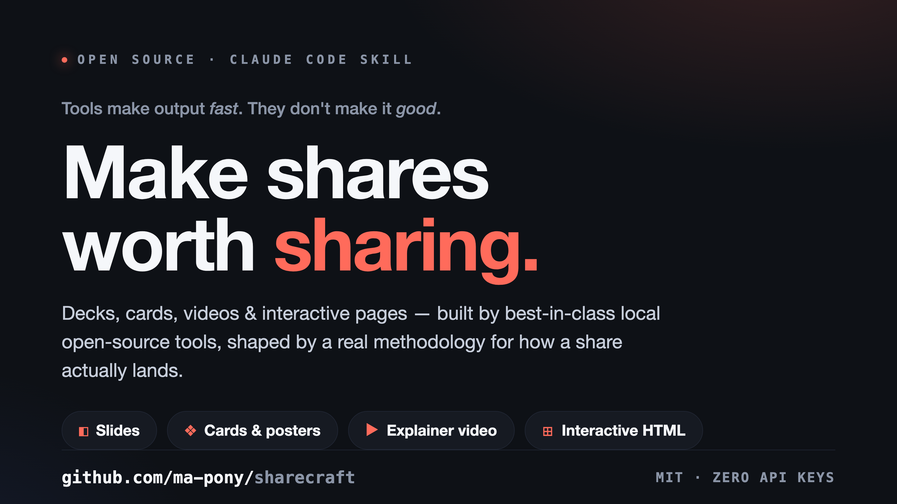

工具让产出更*快*，但不会让它更*好*。一张埋没了重点的漂亮幻灯片、一张缩略图根本看不清的卡片、一个本该 90 秒讲完却拖到 5 分钟的视频——它们都通过了"我用了好工具"这一关，却依然没能打动受众。**Sharecraft 补的正是工具留下的那块空白**：它先逼你做一遍简短的思考（受众是谁、唯一的结论是什么、在哪里被消费），再驱动合适的开源工具产出物料，最后用让每种媒介真正"落地"的原则做一遍自检。

## 它做什么

当你让 Claude 做点可分享的东西时，Sharecraft 会介入并：

1. **先思考**——受众、唯一的结论、你想要的行动、媒介与平台（这比什么都更决定画幅和长度）、以及投入预算。
2. **选媒介并组合**——一份内容内核 → 一套幻灯片 *加* 一张发布卡片 *加* 一段演示 GIF，视觉统一。真正的杠杆在于**串联工具**，而非只用一个。
3. **向最好的学习——学原理，不抄表象**——提炼 3Blue1Brown、Kurzgesagt、Fireship、TED、Tufte 等人反复重新发现的底层原理，再为*你的*主题创造合适的表达。
4. **装好工具再开做**——一条本地、零污染的安装命令（`./setup.sh`）、最小的创作循环、以及如何导出。
5. **交付前自检**——对照该媒介的检查清单 *以及* 共享设计契约里的反模式自检。

## 共享设计契约

四种媒介要保持一致，前提是它们都引用同一份契约。[`references/design-system.md`](references/design-system.md) 就是这份契约——设计 token（一份可直接复制的 `:root`）、单一阅读测量、代码块与流程图 / 图表规格、product / brand 两轨，以及一份反模式自检。它的主线，是从真实生成的页面里踩坑踩出来的：

> **接管*外观*，而非*引擎*。** 工具的默认值是为所有人准备的，所以默认 = 隐形。要显得有意图，只需拨动*一个*风格开关——Mermaid 的 `look:'handDrawn'`、Chart.js 的主题 override——让工具继续干重活（布局、坐标轴、连线）。自己从零重写引擎才是陷阱：更费力、更多 bug、还很少更好。

## 示例

下面每一件物料都由 Sharecraft 驱动的工具产出，并按契约打磨（一套色板、单一强调色、清晰层级、缩略图可读）。所有源文件都在 [`examples/`](examples/)。

**幻灯片**——一套用 [Marp](https://marp.app/) 写的 deck（[`slides-deck.md`](examples/slides-deck.md)）导出为 PNG。标题陈述结论、一页一个想法、最后一页是 call to action：

| | |
|:---:|:---:|
| 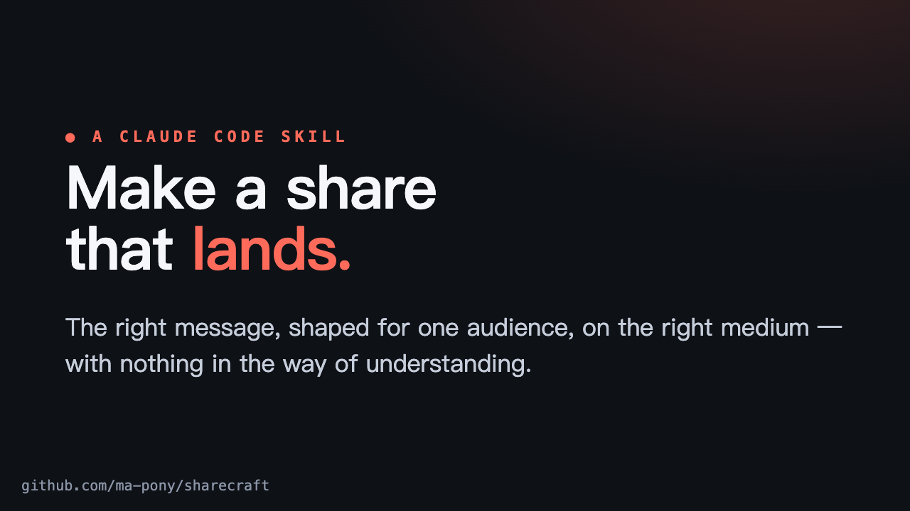 | 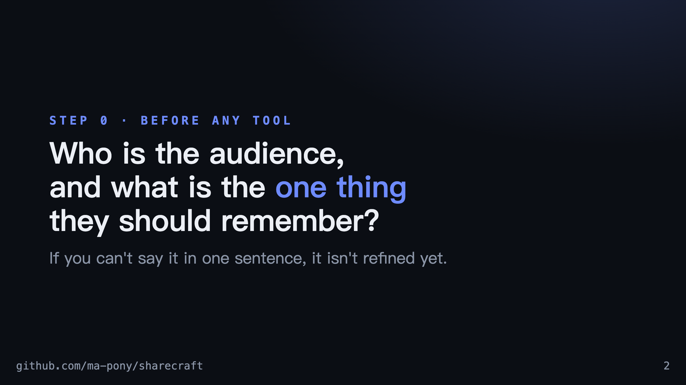 |
| 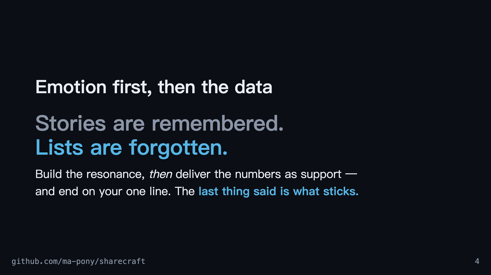 | 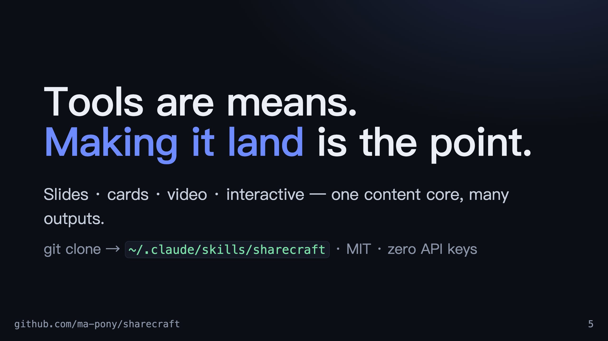 |

**具名版式 recipe 实战**——[`slides.md`](references/slides.md) 里全部十个 `SL01–SL10` recipe 在一套 deck 里逐一落地（[`slide-recipes.md`](examples/slide-recipes.md)），每页都标注了所用 recipe。节选：

| SL04 · 数据主角 | SL05 · 双栏对比 |
|:---:|:---:|
| 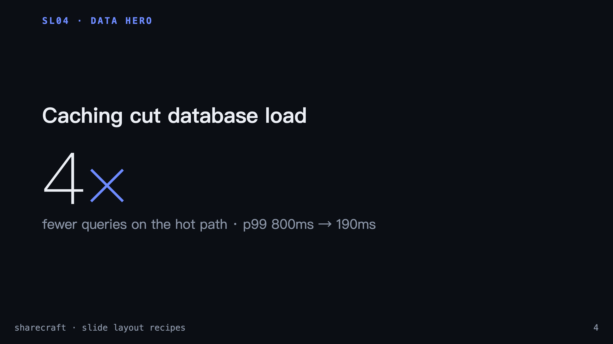 | 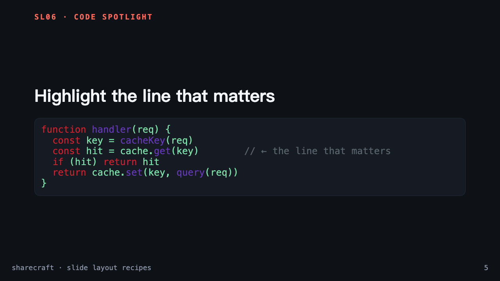 |
| **SL06 · 代码聚光** | **SL07 · 金句引用** |
| 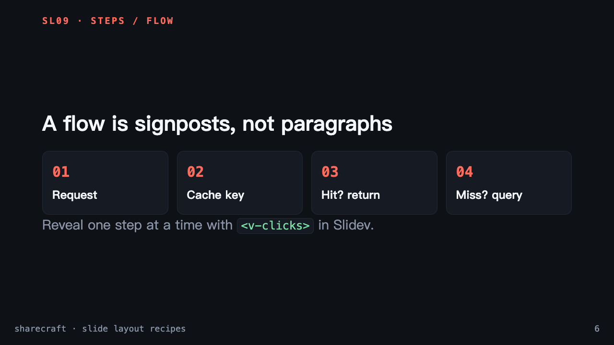 | 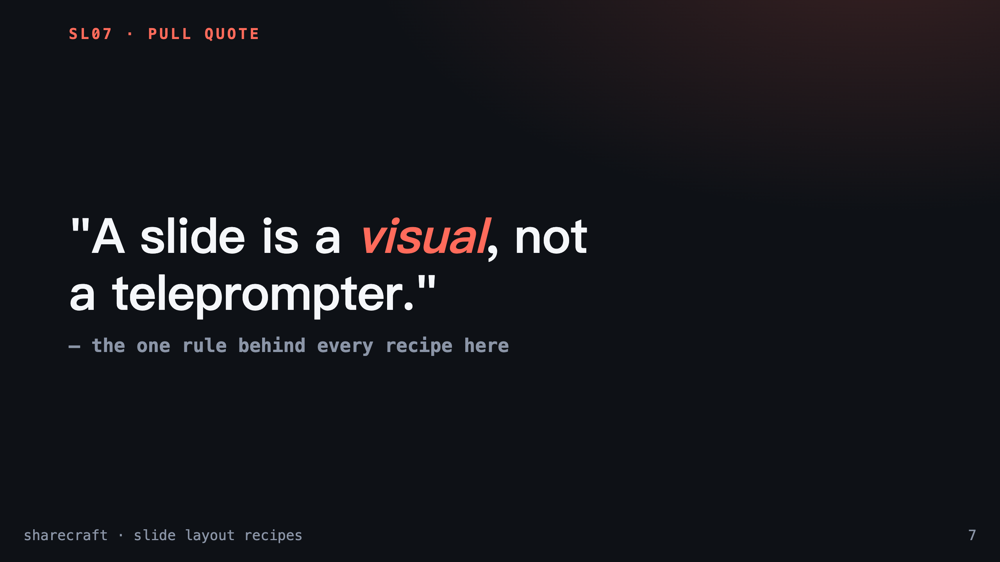 |

**终端 GIF**——用 [VHS](https://github.com/charmbracelet/vhs) 从可复现脚本（[`terminal-demo.tape`](examples/terminal-demo.tape)）录制。一段 15 秒内、脚本化的干净流程——这里演示在一个浏览器会话里批量渲染整套轮播图（`--ids`）：


**讲解动画**——[`video.md`](references/video.md) 里的 `VS02→VS03→VS04` 镜头 recipe（先具体 → 形变到一般式 → 聚光洞察），用 [Manim](https://www.manim.community/) 制作（[`vs-concrete-to-abstract.py`](examples/vs-concrete-to-abstract.py)）：


**可交互 HTML**——[`interactive.md`](references/interactive.md) 里 `IH01–IH08` 中的三个 recipe，每个都是自包含、零 API 的单文件，双击即在浏览器打开。它们践行原理⑥——*主动胜过被动*：你驱动物料，而不是看着它。点击预览看**在线**版本，或读源码：

| IH01 · 可探索 | IH02 · 滚动叙事 | IH03 · 可交互图表 |
|:---:|:---:|:---:|
| [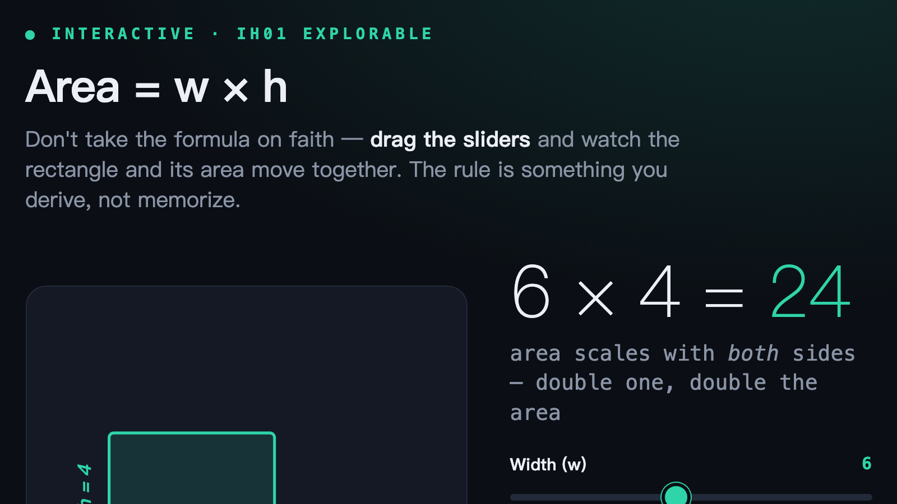](https://raw.githack.com/ma-pony/sharecraft/main/examples/explorable-area.html) | [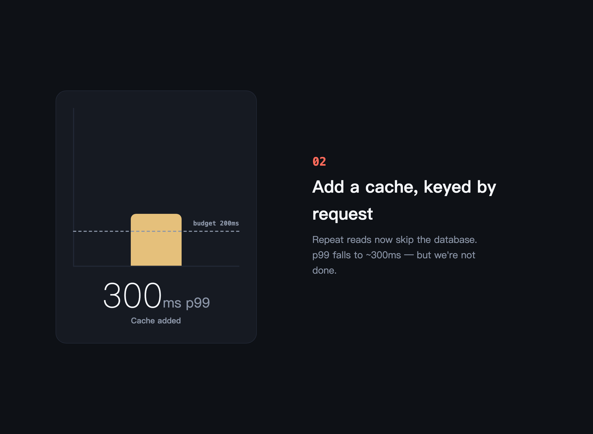](https://raw.githack.com/ma-pony/sharecraft/main/examples/scrolly-latency.html) | [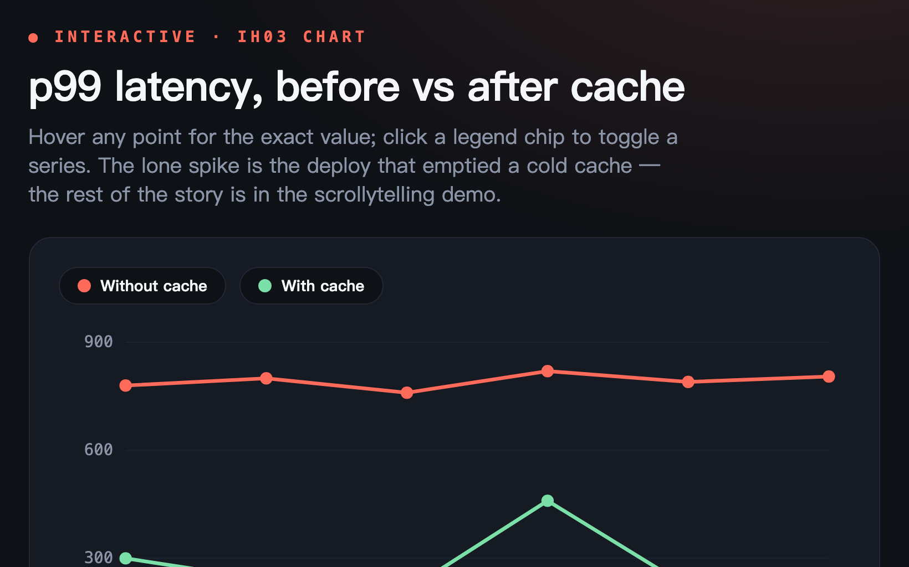](https://raw.githack.com/ma-pony/sharecraft/main/examples/chart-latency.html) |
| *拖动滑块，自己推导出 `Area = w × h`。* [源码](examples/explorable-area.html) | *滚动；固定的图形每步只变一件事（800ms → 190ms）。* [源码](examples/scrolly-latency.html) | *悬停看数值，点击图例切换序列。* [源码](examples/chart-latency.html) |

**流程图**——Mermaid 的 `look: 'handDrawn'`，并主题化到 token（[`design-system.md`](references/design-system.md) §4 的配方）：你把图写成文本，它自动布局并连线；平滑曲线、实色填充、手绘抖动轮廓——不用手写任何 SVG，也没有默认 Mermaid 的死板感。页面外壳保持干净 sans，只有图本身是手绘的：

[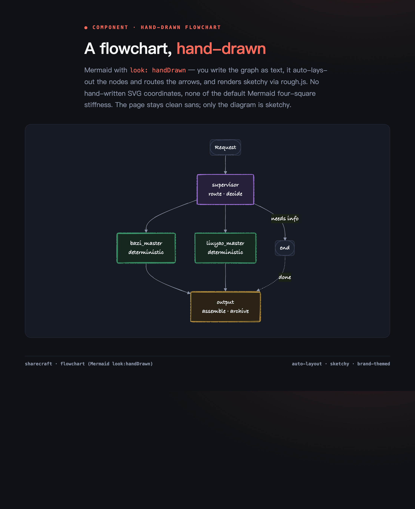](https://raw.githack.com/ma-pony/sharecraft/main/examples/flow-diagram.html)

**图表**——[Chart.js](https://www.chartjs.org/) 配品牌主题 override（[`design-system.md`](references/design-system.md) §4）：库负责坐标轴 / tooltip / 图例，一个 `options` 块换上品牌色、极淡网格和等宽刻度。接管*外观*而非引擎——别手画 SVG 路径：

[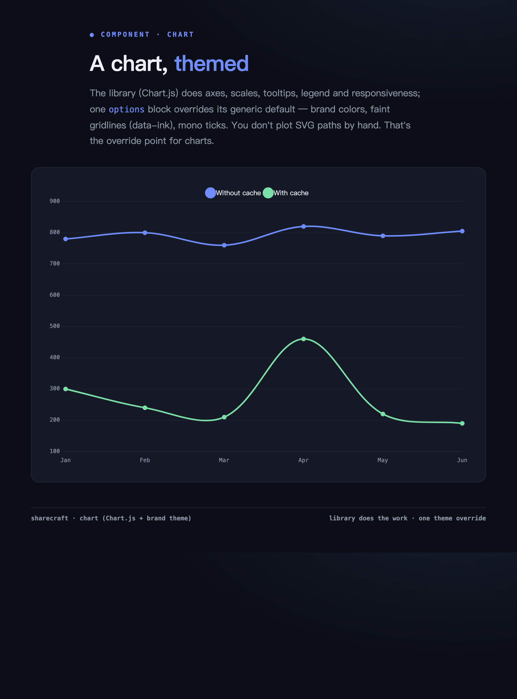](https://raw.githack.com/ma-pony/sharecraft/main/examples/chart-brand.html)

**卡片 & 海报**——手写 HTML，由内置的 [`scripts/html_to_image.py`](scripts/html_to_image.py) 渲染（顶部的主图就是发布卡片；点任意图看源码）：

| 竖版海报 · 小红书 (1080×1350) | 代码卡片 (1600×900) |
|:---:|:---:|
| [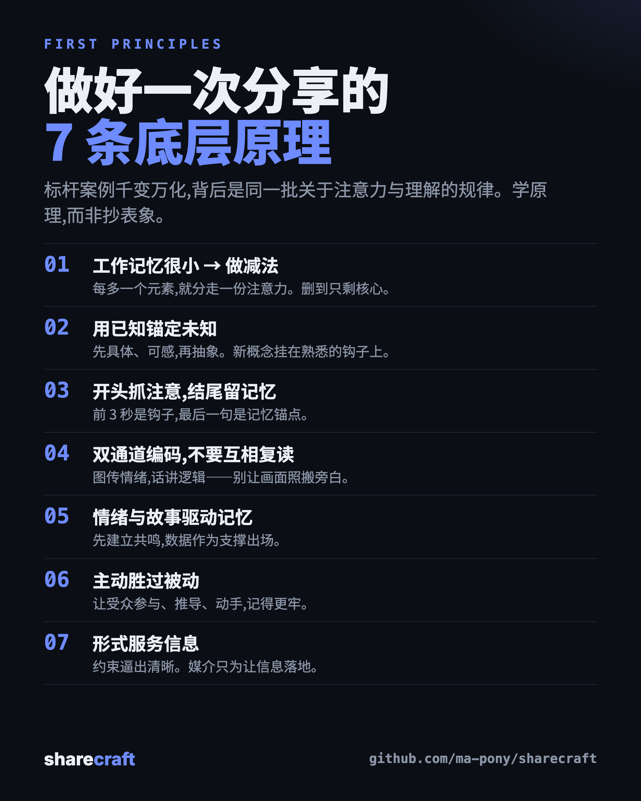](examples/principles-poster.html) | [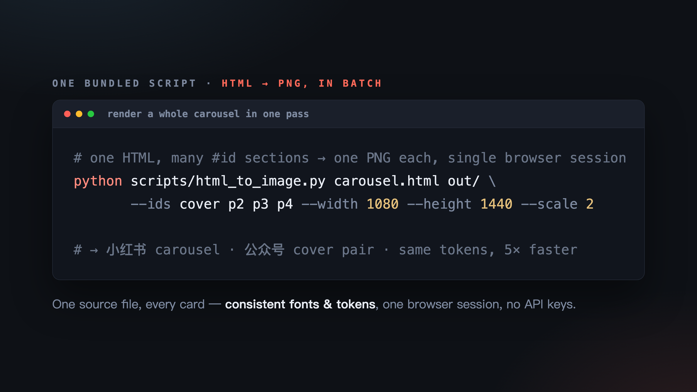](examples/code-card.html) |
| *把 7 条第一性原理提炼成的信息图。* | *为发布而设计的代码截图。* |

## 安装

这是一个 [Claude Code](https://claude.ai/code) skill。克隆它，然后运行**一条**安装命令：

```bash
git clone https://github.com/ma-pony/sharecraft.git ~/.claude/skills/sharecraft
cd ~/.claude/skills/sharecraft && ./setup.sh
```

`setup.sh` 会构建一条**完全自包含、本地**的工具链：`.venv` *和* chromium 浏览器都装在 **skill 目录内**——不碰你的系统 Python、全局 `npm` 或 `~/.cache`。**卸载只需删掉这个目录**（或运行 `./setup.sh --clean`）。它优先用 [`uv`](https://github.com/astral-sh/uv)，没有则回退到标准 `venv`。

它是分层的，默认保持轻量。核心覆盖卡片、海报、信息图和可交互 HTML 预览；幻灯片工具走 `npx`（无需安装），更重的媒介工具按需启用：

| 命令 | 增加 |
|---|---|
| `./setup.sh` | **核心**——HTML→PNG 引擎（Playwright + 目录内的本地 chromium） |
| `./setup.sh --video` | Manim + venv 内的 ffmpeg——概念动画和 GIF（无需 `brew install ffmpeg`） |
| `./setup.sh --terminal` | VHS——脚本化终端 GIF |
| `./setup.sh --all` | 以上全部 |

然后用自然语言让 Claude 做就行——没有要记的命令：

- *"给这个项目做一张社媒卡片"*
- *"把这个 README 变成一套演讲 deck"*
- *"用一个短视频讲清楚这个概念"*
- *"为它做一个可交互的 explorable / 仪表盘"*
- *"把这段代码做成漂亮的截图"*
- *"录一段安装流程的终端 GIF"*

只要意图是**做点东西来分享**，即使你只说目标、或只点名某个工具，skill 都会被触发。

## 里面有什么

`SKILL.md` 是地图；细节在 `references/`（按需加载）：

| 文件 | covers |
|------|----------------|
| [`references/methodology.md`](references/methodology.md) | 灵魂——Duarte、Minto、Reynolds、Tufte、Mayer、TED 经典。叙事弧、视觉设计、认知负荷、画幅表、各媒介检查清单。 |
| [`references/exemplars.md`](references/exemplars.md) | 从标杆学习 → 反推第一性原理 → 创新。7 条底层原理，以及每个标杆如何表达它们。 |
| [`references/design-system.md`](references/design-system.md) | 共享视觉契约——token + 可复制 `:root`、单一阅读测量、代码块 / 流程图 / 图表规格、product/brand 两轨、反模式自检。 |
| [`references/slides.md`](references/slides.md) | Slidev、Marp、reveal.js、Pandoc、Patat、Impress.js；recipe SL01–SL10。 |
| [`references/images.md`](references/images.md) | HTML→PNG 引擎、Satori、markdown-to-image、迅排设计、文颜、Carbon/CodeImage、Mermaid/Excalidraw/Draw.io；recipe XC01–XC08。 |
| [`references/video.md`](references/video.md) | Remotion、Manim、Motion Canvas、VHS、asciinema+agg、OBS、ffmpeg；镜头 recipe VS01–VS10。 |
| [`references/interactive.md`](references/interactive.md) | 可交互 HTML——explorable、仪表盘、滚动叙事、实时 demo；recipe IH01–IH08，单文件 & 零 API。 |
| [`references/combine.md`](references/combine.md) | 串联工具——一份内容内核贯穿 deck + 图片 + 视频 + explorable。 |
| [`scripts/html_to_image.py`](scripts/html_to_image.py) | 基于 Playwright 的 HTML/CSS → PNG 渲染器（含 `--ids` 批量）——通用的卡片 / 海报 / 信息图引擎。 |

## 一口气讲完方法论

尊重受众的注意力。每个元素要么因有助理解而留下，要么被删。命名你想要的 **before→after 转变**。只承载**一个**想法。先给答案（Minto）。**情绪先于信息**；**结尾是记忆锚点**。一页幻灯片 / 卡片 / 镜头只讲一个想法；图胜过重复的文字；留白是工具；大字号逼出清晰；干掉 chartjunk（Tufte）。按它被消费时的尺寸来做。在最后明确陈述一个行动。——详见 [`references/methodology.md`](references/methodology.md)。

## 集成的工具（全部本地，无需 API key）

- **幻灯片**——Slidev · Marp · reveal.js · Pandoc · Patat · Impress.js
- **图片 / 海报 / 卡片**——HTML→PNG (Playwright) · Satori · markdown-to-image · 迅排设计 poster-design · 文颜 wenyan · Carbon / ray.so / CodeImage · Excalidraw · Mermaid · Draw.io
- **视频 / GIF**——Remotion · Manim · Motion Canvas / MotionForge · VHS · asciinema + agg · OBS · ffmpeg
- **可交互 HTML**——原生 JS · D3 / Observable Plot / Chart.js · Three.js · GSAP / Motion One · Scrollama · Leaflet / MapLibre · CodeMirror / Sandpack · KaTeX / Mermaid

Sharecraft 刻意避开任何需要付费 API 或平台鉴权的东西——一切都在你本机运行。

## HTML→PNG 小工具

这个唯一内置的脚本能把任意 HTML/CSS 渲染成像素级精确的 PNG——适合社媒卡片、公众号封面、小红书轮播和信息图。`./setup.sh` 之后，用 skill 本地的解释器调用它（会自动找到目录内的 chromium）：

```bash
.venv/bin/python scripts/html_to_image.py card.html card.png --width 1080 --height 1350 --scale 2
.venv/bin/python scripts/html_to_image.py deck.html out/ --ids cover p2 p3 --width 1080 --height 1440   # 批量出轮播
```

## 致谢

Sharecraft 站在它所集成的每一个开源项目的肩膀上，也站在 Nancy Duarte、Barbara Minto、Garr Reynolds、Edward Tufte、Richard Mayer 以及它研究的那些标杆创作者的沟通手艺之上。它教的是*向他们学习*——而非照抄。

## License

[MIT](LICENSE) © 2026 Pony.Ma
